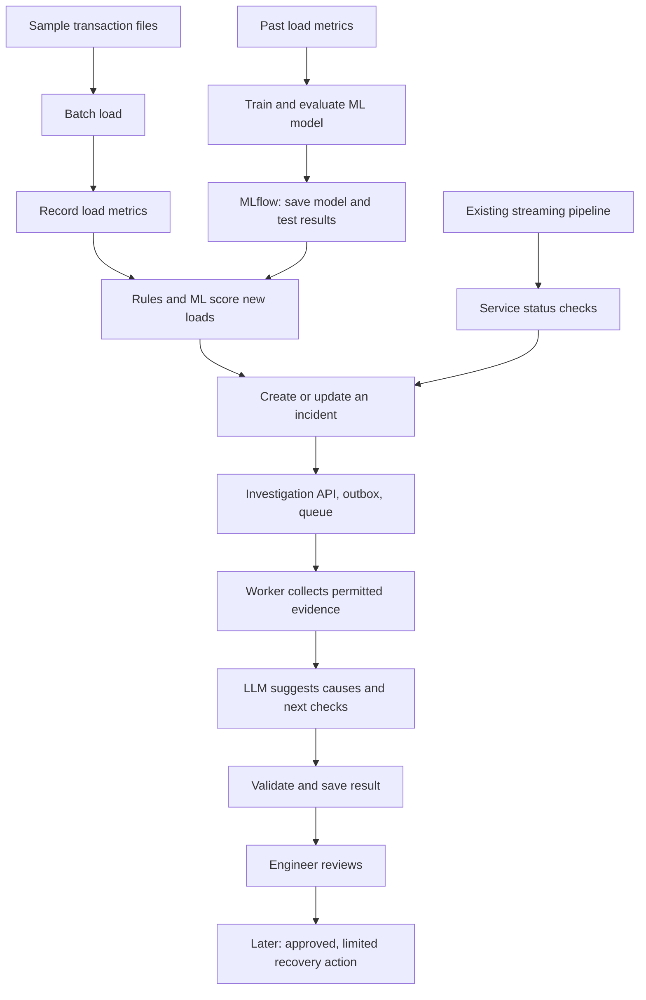

# Two projects, built one step at a time

Updated: 2026-09-14. This plan incorporates the attached project ideas. It does not mean their features are already built.

## Project 1: detect and investigate data problems — this repo

Keep the repository name and financial pipeline. Expand its purpose: detect failed jobs **and** bad data in jobs that report success, then help an engineer investigate.

Example: a supplier file normally contains about 10,000 rows. Today the job succeeds but loads 1,500 rows, with many missing cost centers. Detect the unusual load, collect evidence, and explain possible causes. The missing data is the problem; a successful job status does not rule it out.

### Reuse and add

| Part | Status and purpose |
|---|---|
| Financial Postgres → Debezium → Kafka → Flink → analytics | Existing invoice flow; a real workload to observe. Full-cluster Flink resume still needs work. |
| FastAPI investigation service | Existing: accepts a manually supplied report, validates evidence quotes, saves results in Postgres. |
| Tests, incident examples, Docker setup | Existing foundation. Model responses in tests are mocked; live answer quality is not yet measured. |
| Batch input and quality metrics | Planned: supplier transaction files, row counts, missing values, duplicates, processing duration. |
| Flink monitoring | Planned: read job status, detect repeated failures, and gather failure details. |
| Rules and anomaly-detection ML | Planned: compare fixed checks with a model trained on past load metrics. |
| MLflow | Planned: save training settings, data/code versions, models, and evaluation results. |
| Async jobs, evidence collection, review | Planned: queue work, collect evidence automatically, and record human decisions. |
| RAG, agent tools, MCP | Later stages; do not add them all at once. |

### How the parts connect

Training means learning patterns from past metrics. Inference means using the saved model to score a new load. Neither requires sending transaction rows to an LLM. The LLM receives selected evidence only when there is something to investigate.

### First requirements: batch quality checks

Proposed next code step; pending confirmation of priority against Flink monitoring.

- Use generated supplier transaction files, with stable batch IDs and a file checksum. Keep bad input outside operational invoice tables so database constraints cannot hide the quality problem.
- Track one load attempt separately from the logical batch. Re-running a file must not silently double its rows or its training examples.
- Record dataset/source, batch ID, attempt ID, expected business date, start/end times, status, schema version, and metric definitions.
- Calculate input/output row counts, missing cost-center rate, duplicate transaction-key rate, and processing duration. Define duplicate rate as extra occurrences beyond the first, divided by input rows. For zero rows, rates are undefined; record an empty-load finding instead of dividing by zero.
- Begin with configurable rules. Compare row count with prior comparable loads from the same source; record when too little history exists. Legitimate differences such as weekdays must not automatically become errors.
- Store each finding with its measured value, threshold, source batch, and rule version. A finding is an observation, not a proven root cause.
- Test normal data, empty files, partial loads, missing fields, duplicate keys, invalid schemas, and repeated submissions. A parser/load failure and a successful-but-unusual load are separate outcomes.
- Produce a report and evidence JSON compatible with the existing investigation API. Do not automatically incur model charges when a batch runs.
- Run manually; do not add a daily schedule or leave services running.

### Add actual ML after metrics exist

Compare a simple rule baseline with an anomaly detector, such as Isolation Forest; model choice remains open. Train using numeric load metrics, not error descriptions or known failure labels embedded in the features.

Use earlier loads for training, a later validation period for choosing thresholds, and a final held-out period for evaluation. Fit preprocessing only on training data. Keep repeated versions of the same batch in the same split. Never adjust thresholds using the final test results.

Test both deliberately introduced problems and legitimate variation. Measure precision (how many alerts were real problems), recall (how many problems were detected), false alarms, and detection delay per problem type. Compare rules and ML on the same data. If ML does not improve results, keep rules as the default and publish that finding.

MLflow should record data version, feature definitions, code commit, parameters, metrics, model artifact, and evaluation report. A scheduler would invoke future predictions; MLflow tracking itself is not our scheduler. Promotion, rollback, and drift checks come after a measured baseline. A model flag does not establish the cause or authorize a repair.

### Make investigations reliable

The current synchronous API is still the implemented design. The planned change is:

1. Save the incident job and an outbox message in one Postgres transaction; return a job ID immediately.
2. Publish the job ID to the chosen queue. Publishing may repeat, so workers must handle duplicates.
3. Let a worker claim the job with an expiring lease, collect a bounded set of evidence, call the LLM, and save the result.
4. Use request IDs, attempt records, bounded retries, and a dead-letter path. Recover abandoned jobs explicitly; do not promise exactly-once model billing after timeouts.
5. Limit evidence by dataset, service, time range, and user access. Check access before evidence enters the prompt. Keep full logs in log/object storage and selected evidence plus references in Postgres.
6. Test worker crashes, failed evidence tools, duplicate messages, provider outages, and missing evidence. Measure answer quality separately from API correctness.

Kafka and Azure Service Bus are alternatives, not two required queues. Kafka supports the streaming learning goal; Service Bus is a managed work-queue option for Azure. An Azure Function could run the worker. No queue change is accepted yet.

Later, add specific read-only tools for load history, quality findings, and runbooks. Only after these work should an agent choose which tool to call. Expose tested tools through MCP in its own stage.

### Human approval and recovery

Initially return suggestions only. Later support approval, rejection, and correction as saved workflow states. Bind approval to an exact action, target batch, and evidence version; changed targets or stale approvals require review again. The LLM cannot approve itself.

Start with a safe, test-only action such as quarantining a generated batch. Use a unique action ID, durable execution record, and an idempotent action handler. Test repeated approvals, worker crashes after execution, and rejected requests. Add reruns only after their duplicate-write behavior is understood.

### Local learning and Azure deployment

| Concern | Low-cost local path | Separate Azure deployment step |
|---|---|---|
| Batch processing | Python/SQL first, or local PySpark + Delta when batch engine is selected | Azure Databricks with PySpark and Delta |
| Data/model access | Local roles and explicit test permissions | Unity Catalog policies and workload identity |
| ML lifecycle | Open-source MLflow during experiments | Databricks-managed MLflow and registry |
| Investigation | Existing FastAPI + Postgres; provider adapter later | Hosted API/worker, managed database, Azure-hosted model |
| Agent workflow | Explicit Python calls first | Consider LangGraph only when branching and saved state require it |

Local Python is not evidence of Databricks experience; local permissions are not a Unity Catalog demo. Record a real deployment and access-control test before making those claims. Cloud resources, model choice, cost limits, framework versions, and teardown instructions need their own decisions. No paid resources or schedules are created by this plan.

### Learning order

The original eight AI stages remain: AI + Data API → RAG → agent tools → MCP → full evaluation framework → production deployment → optional fine-tuning → capstone. Basic tests and small evals start with every stage.

The new data/ML work extends the first project: collect metrics → rules → train and compare ML → track models → feed useful evidence to the AI API. These are focused additions, not a reason to build all eight AI stages at once. Fine-tuning an LLM is different from training an anomaly detector.

## Project 2: healthcare referral evidence assistant — separate repo later

Purpose: check whether a sample referral includes the required records and show sources for missing or present information. It supports administrative review; it does not diagnose a patient or establish production healthcare compliance experience.

Keep this separate because its entities, access rules, reference cases, and users differ from pipeline investigation. Do not create a new repo until its first requirements are agreed.

### Planned stages

1. Generate or obtain Synthea sample FHIR data. Inspect actual exports first; do not assume the selected generator includes the needed ServiceRequest/referral examples. Add clearly labeled test referrals and sample policies if needed.
2. Validate Patient, Encounter, Observation, ServiceRequest, and Organization IDs, references, dates, and required fields for the chosen FHIR version/profile. Keep patient records separate from investigation logs.
3. Define an ontology: entity types, allowed relationships, and identifiers. Evaluate Stardog for graph queries only after a question needs connected records; licensing and local operation are not yet verified.
4. Compare SQL for exact facts, vector search for policy passages, and graph queries for linked records. Select policy versions by effective date and access rights. Do not assume combined retrieval beats SQL plus vector search.
5. Start with one agent and source-linked summaries. Measure missing-record detection, correct sources, unsupported claims, conflicting documents, and refusal when evidence is insufficient.
6. Pause before changing referral status. Save approval, correction, rejection, and resume state; test repeated requests and process crashes.
7. Test that unauthorized records cannot enter SQL/vector/graph results, model context, caches, or logs. Use sample users and patients only.

DeepAgents and Orkes are candidates from the attachment. If adopted, give DeepAgents responsibility for agent planning/tool calls and Orkes responsibility for the outer job state, retries, and approval. Avoid two independent retry/approval controllers. Start with one agent; compare a second evidence-review agent on the same reference cases before keeping it.

### What can be reused

Reuse ideas and tested interfaces: provider calls, input/output validation, evidence IDs, request IDs, job status, approval records, evaluation structure, and Docker/CI patterns. Healthcare authentication, evidence selection, prompts, and retention require a new design. Extract a shared package only when both projects actually need the same code.

## Portfolio proof for both projects

Each project needs a runnable demo, an architecture diagram, ADRs, evaluation results, deployment instructions, a small set of known failures, and an honest list of limits. Distinguish mocked model tests, live model evals, local runs, and cloud runs. Do not claim real production volume, Epic integration, or compliance from sample-data demos.

## References checked for this plan

- [Databricks MLflow](https://learn.microsoft.com/en-us/azure/databricks/mlflow/): experiment tracking, evaluation, registry, and model deployment. Managed and open-source setups differ.
- [Synthea](https://github.com/synthetichealth/synthea): source for generated patient data; verify required exports before designing around them.
- [DeepAgents](https://docs.langchain.com/oss/python/deepagents/overview) and [Orkes](https://docs.orkes.io/content/agentic-workflow-engine): candidate agent and workflow tools, not a tested combination in this project.
